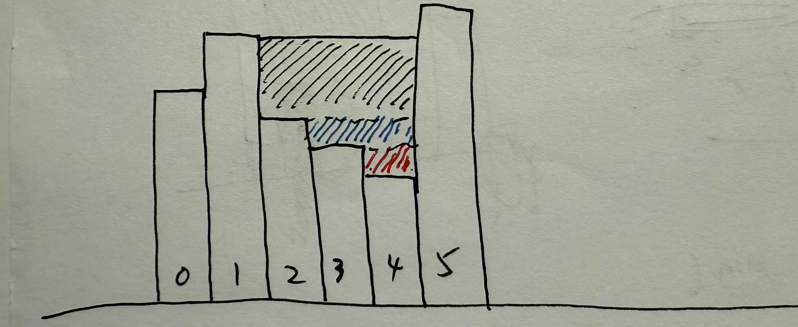

# Notes for LeetCode Hot100

## 常用STL

### vector

初始化方法：

- 默认构造函数：`vector<int> v1;`创建一个空的整型向量
- 指定大小初始化：`vector<int> v2(5)`创建大小为5的向量，每个元素默认值为0
- 指定大小和初始值：`vector<int> v3(5, 10)`创建大小为5的向量，每个元素默认值为10
- 使用列表初始化：`vector<int> v4 = {1, 2, 3, 4, 5}`

### 字符串

如何判断两个字符串是否相等：

- string A 和 string B是否相等：直接使用`==`运算符比较：`A==B`
- string A的某部分和string B的某部分是否相等：
    - 使用`substr`来判断：A.substr(0, 5)从位置0开始的5个字符
    - 使用`compare`来判断：A.compare(0, 5, B, 3, 5)   

### unordered_map

引入头文件：

```cpp
#include <iostream>
#include <unordered_map>
```

创建一个对象：

```cpp
std::unordered_map<std::string, int> ageMap;
```

访问元素：

```cpp
# 插入元素
ageMap['Alice']= 25;
ageMap.insert({"Charlie"， 20})；
```

遍历元素：

```cpp
for (const auto& pair: ageMap) {
    pair.first; pair.second;
}
```

查找元素：

```cpp
if (ageMap.find("Alice") != ageMap.end()) {
    std:cout << ageMap["Alice"] <<endl;
}
```

大小和清空：`ageMap.size()`和`ageMap.clear()`

### unordered_set

无序集合，可以起到去重作用。插入：`s.insert(elem)`，判断某个元素是否存在：`s.count(elem) > 0`或者`s.contains(elem)`。

## 数学定理

**[定理1：四平方和定理]**   任意一个正整数都可以表示至多四个正整数的平方和。事实上，当$n=4^k \times (8m+7)$时，$n$只能表示为四个正整数的平方和。

## 哈希

> 哈希问题大致可以分为两种类型：1）value记录的是key的性质，比如下标、出现次数；2）value只需要表明key是否存在即可，此时只要用一个集合`unordered_set`存就行。

### 两数之和【1】

核心思路是 **边遍历，边存哈希和找互补数，也就是采用一趟完成**。可以理解为，走过的路，每一步都算数。即：每遍历到一个数，先看他互补的那个数有没有在hashMap里面，在的话直接返回即可；如果不在，则先存到hashMap里面。这样以来，便直接解决了两个问题：

1. 单个等于target一半的元素。由于第一次遇到的时候存入了hashMap且不会第二次遇到，所以不会假阳；
2. 两个等于target一半的元素。遇到第一个的时候存入了hashMap，遇到第二个的时候，互补的已经在hashMap里面，便可以直接返回。

### 字母异位词分组【49】

核心在于，如何给字母异位词构造相同的$key$。这里的思路是：将单词中各个字母的出现次数按照a-z的顺序拼接成一个字符串。注意，一定要在拼接的时候给 次数 之间加上分隔字符，否则会出现$11\,0$和$1\,10$是相同的Key的情况。

另外，**array的使用：初始化`array<int, 26> arr = {}`** 一定要显式初始化为默认值（0），否则他好像在循环block内部会一直使用最开始初始化的那个……，服了。

### 最长连续序列【128】

看上去是一个dp问题，实则是一个哈希问题。关键在于优化序列寻找过程。注意到，找序列的过程实际上就是 以某个元素$a$为出发点向下向上伸展的过程。对于向下而言，如果在集合中存在一个恰好比$a$小1的元素，那么说明$a-1$构成的连续序列的长度一定比$a$为起点的长，则不需要考虑$a$，遇到$a-1$的时候直接考虑$a-1$就行。以此类推，如果存在着一个$elem$没有比它小的元素在集合里面，说明$elem$是可以作为序列起点的。以$elem$为起点，向上延伸寻找就行。

## 双指针

### 移动零【283】

双指针问题。抓住左右指针的不变性质：即左指针始终指向已排列好序列的下一个首零，右指针始终指向待排序列的第一个元素。考虑两个点：

- **指针位置的初始化。** 直觉上，l和r初始化为0就可以。验证一下合理性：如果序列第一个元素不是0，那么会同时移动到第一个0，然后右指针移动；如果序列第一个元素是0，那么右指针直接移动。
- **指针到位后的处理。** 直觉上，到位后应该l和r位置的元素交换，然后l和r同时递增1。验证合理性：如果$r = l + 1$，则交换之后r的位置变为0，移动后l重归于第一个0；如果$r - l > 1$，则显然交换之后进行递增，l位置的依然是0，合理。

### 盛最多水的容器【11】

使用**相向双指针**来完成。通过*数学性质*的使用来简化计算。注意到，在相向而行的过程中，如果移动的是高处的指针，由于木桶效应的存在，area的面积只会减少而不会增加。

### 三数之和【15】

注意到，可以先对数组排序（直接应用stl algorithm中的`sort`函数）。这里有三个数，如何利用双指针？两种思路思考：

- intuitive的方式：既然是双指针，那说明肯定要固定一个。所以从小到大遍历$a$即可。之后，由于$b$ and $c$的sum是固定的，所以是**相向**双指针。
- 优化算法的角度：最笨的方式是三层for循环遍历，那么如何优化呢？考虑内两层循环，事实上，对于和固定的$target$而言，完全不需要两层都从小到大来一遍，完全可以**相向双指针**。

### 接雨水【42】
<p align="center">
    
</p>

[CoolApply公众号对于双指针的解决攻略](https://mp.weixin.qq.com/s/adHMfC0Fu1BC7Puqj2exzQ)，其中含有接雨水的思路解析。核心破题点：**正难则反**。如果直接考虑每个坑能装多少水，显然很麻烦，因为要全面考虑坑的形状，这太离谱了；于是我们换个角度，考虑每个柱子能贡献多少水量。
观察性质，可以发现，每个柱子能够贡献的水量按照如下方式得到：$$w[i] = \text{min}(lmax, rmax) - height[i]$$

#### 法1：动态规划

我们可以先用动态规划的思想，求出每个位置的`lmax`和`rmax`，然后累加每个位置的柱子贡献的水量。

```cpp
int trap(vector<int>& height) {
    int n = height.size();

    int* lmax = new int[n]{0};
    lmax[0] = height[0];
    int* rmax = new int[n]{0};
    rmax[n - 1] = height[n - 1];

    for (int i = 1; i < n; i++) {
        lmax[i] = max(lmax[i - 1], height[i]);
    }
    for (int i = n - 2; i >= 0; i--) {
        rmax[i] = max(rmax[i + 1], height[i]);
    }

    int res = 0;
    for (int i = 0; i < n; i++) {
        res += min(lmax[i], rmax[i]) - height[i];
    }

    return res;
}     
``` 

#### 法2：双指针

由于动态规划会带来比较大的空间占用，所以可否采用**边走边算**的思路来完成呢？当然可以，也就是使用双指针，边算$lmax$和$rmax$，边得到蓄水量。考虑其正确性：首先，由于我们并不关心$lmax$和$rmax$的值，只关注小的那个是多少，所以，考虑$\text{lmax}[l] < \text{rmax}[r]$下的两种情况：

- 在l和r中间存在一个位置mid，使得$height[mid]$小于$rmax[r]$，此时，由于找的是位置i往右的max值，所以一定大于等于$rmax[r]$
- 在l和r中间存在一个位置mid，使得$height[mid]$大于等于$rmax[r]$，此时，$lmax[l]$依然是较小的那个。

```cpp
int trap(vector<int>& height) {
    int l = 0, r = height.size() - 1;
    int lmax = height[l], rmax = height[r];
    int res = 0;

    while (l < r) {
        if (lmax < rmax) {
            res += lmax - height[l];
            l++;
            lmax = max(lmax, height[l]);
        }
        else {
            res += rmax - height[r];
            r--;
            rmax = max(rmax, height[r]);
        }
    }

    return res;
}
```

同时注意到，双指针其实更快（完全的$O(n)实现），而动态规划要$O(3n)$，是同数量级下的不同系数之间的运行效率区别。

#### 法3：栈
<p align="center">
    
</p>

emmm...，个人认为栈的思路不如前两种好理解。如上图所示，把竖直方向上的思考角度变为横向的思考角度。注意到，每一块水坑的构成其实从左往右看都可以视为一个**单调栈**，一个柱子右侧容纳的水量取决于何时遇到比它高的柱子，故可以编写如下程序进行解决：

```cpp
int trap(vector<int>& height) {
    int res = 0;
    vector<int> stack = {};

    for (int i = 0; i < height.size(); i++) {
        while (stack.size() != 0 && height[stack.back()] < height[i]) {
            int low = height[stack.back()];
            stack.pop_back();
            if (stack.size() == 0) break;
            int high = min(height[i], height[stack.back()]);
            res += (high - low) * (i - stack.back() - 1);
        }
        stack.push_back(i);
    }
    
    return res;
}
```

## 动态规划

### 爬楼梯【70】 | 杨辉三角【118】

很简单。爬到第$n$阶的方法数等于爬到第$n-1$阶的方法数加上爬到第$n-2$阶的方法数；杨辉三角则相当于一个二维dp的题目，直接按照二维dp的思路处理即可。

### 打家劫舍【198】

**一种dp范式: `dp[i][0]`和`dp[i][1]`。** 至于dp的更新思路，比较简单，如果位置$i$不抢劫，则上一个抢的位置可能是$i-1$也可能是$i-2$，分别对应$dp[i-1][1]$和$dp[i-1][0]$；如果位置$i$抢劫，则前面的方式只有一种，那就是$i-1$位置不抢劫，即$dp[i-1][0] + nums[i]$。

### 完全平方数【279】

核心公式：
$$
 f[i] = 1 + \text{min}_{j=1}^{\sqrt{i}}f[i - j*j]
$$

